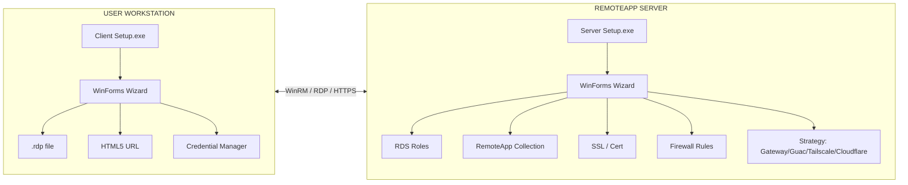

# Rdp Virtual Box App

**Türkçe:** Windows Server üzerinde **herhangi bir uygulamayı** (ERP, muhasebe, raporlama, özel exe…) RemoteApp olarak yayınlayan ve son kullanıcı bilgisayarına tek tıkla `.rdp` kısayolları üreten **iki parçalı** bir kurulum ürünüdür.

**English:** A two-part setup product that publishes any application on Windows Server as a RemoteApp and produces `.rdp` shortcuts on end-user workstations with a single click.

> **Marka bağımsızdır.** Ürün adı **Rdp Virtual Box App**'tır; yayınlanan uygulamalar tamamen sunucu tarafından ve kullanıcı tarafından belirlenir.

---

## İçindekiler / Table of Contents

- [Proje Hakkında / About](#proje-hakkında--about)
- [Özellikler / Features](#özellikler--features)
- [Hızlı Başlangıç / Quick Start](#hızlı-başlangıç--quick-start)
  - [Server Kurulumu](#server-kurulumu)
  - [Client Kurulumu](#client-kurulumu)
- [Bağlantı Stratejileri](#bağlantı-stratejileri)
- [Mimari](#mimari)
- [Ekran Görüntüleri](#ekran-görüntüleri)
- [Dokümantasyon](#dokümantasyon)
- [Lisans](#lisans)
- [Katkıda Bulunma](#katkıda-bulunma)
- [Sürüm Geçmişi](#sürüm-geçmişi)

---

## Proje Hakkında / About

**Rdp Virtual Box App**, küçük ofisten kurumsal yapılara kadar her ölçekte **Remote Desktop Services** kurulumunu standart hale getiren iki EXE'den oluşur:

| EXE / DMG | Hedef | Çalışma Yeri | Yaptıkları |
|---|---|---|---|
| `RdpVirtualBoxApp-Server-vX.X.X.exe` | IT Admin | Windows Server (elevated) | RDS rolleri, RemoteApp yayını, sertifika, lisans tespiti, Guacamole/Tailscale/Cloudflare fallback, Probe REST API |
| `RdpVirtualBoxApp-Client-vX.X.X.exe` | Son kullanıcı | Windows 10/11 | Sunucu tespiti, uygulama seçimi, `.rdp` üretimi, Start Menu kısayolu, web kısayolu |
| `RdpVirtualBoxApp-Client-macOS-vX.X.X.dmg` | Son kullanıcı | macOS 12+ | SwiftUI 4 adımlı sihirbaz, Keychain entegrasyonu, Microsoft RDP entegrasyonu, HTML5 launcher |

Sıralama önemlidir: **Önce Server kurulur, sonra Client dağıtılır.**

---

## Özellikler / Features

- **Tamamen generic** — yayınlanan uygulamalar sunucuda ne varsa odur (ERP, muhasebe, raporlama, özel exe).
- **Çoklu bağlantı stratejisi** — Direct / RD Gateway / Apache Guacamole / Tailscale / Cloudflare Tunnel / Hybrid (birden fazlasını aynı anda seçebilirsiniz).
- **HTML5 fallback** — RD Web lisansı yoksa otomatik Apache Guacamole kurulumu önerir.
- **Credential Manager** entegrasyonu — şifre düz metin kaydedilmez.
- **PWA manifest** desteği — Edge/Chrome üzerinden "uygulamayı yükle".
- **WinForms wizard** — modern Aero arayüzü, Türkçe varsayılan.
- **Otomatik log + rollback** — kurulum hata verirse kısmi kurulumları geri alır.
- **CI/CD** — GitHub Actions ile `windows-latest` ve `macos-latest` runner'ları üzerinde otomatik derleme.
- **macOS desteği** — SwiftUI tabanlı yerel istemci (DMG) + Web Modu (HTML5) her iki yol da kullanılabilir.

---

## Hızlı Başlangıç / Quick Start

### Server Kurulumu

```powershell
# 1. Releases sayfasından RdpVirtualBoxApp-Server-vX.X.X.exe indirin
# 2. Yönetici olarak çalıştırın
RdpVirtualBoxApp-Server-v1.0.0.exe

# 3. 7 adımlı sihirbazı takip edin:
#    1. Hoş geldiniz + sunucu bilgisi
#    2. Bileşen seçimi (RDS, Cert, RD Web, Gateway, Guacamole…)
#    3. Lisans kontrolü (otomatik)
#    4. Bağlantı stratejisi seçimi
#    5. Uygulama seçimi (AppScanner ile .exe tarama)
#    6. İnceleme
#    7. Kurulum (rollback destekli)
```

Daha fazla bilgi için: [docs/server-setup-guide.md](docs/server-setup-guide.md)

### Client Kurulumu

```powershell
# 1. Kullanıcıya RdpVirtualBoxApp-Client-vX.X.X.exe dağıtın
# 2. Kullanıcı çalıştırır
RdpVirtualBoxApp-Client-v1.0.0.exe

# 3. 4 adımlı sihirbaz:
#    1. Sunucu IP + kimlik bilgisi
#    2. Server Probe sonuçları (yeşil/sarı/kırmızı)
#    3. Uygulama + bağlantı tipi seçimi (Native / Web / Both)
#    4. İnceleme + Install
```

Daha fazla bilgi için: [docs/client-setup-guide.md](docs/client-setup-guide.md) — Windows istemcisi için.

### macOS Client Kurulumu

```bash
# 1. Releases sayfasından RdpVirtualBoxApp-Client-macOS-vX.X.X.dmg indirin
# 2. Çift tıklayıp Rdp Virtual Box App.app'i Applications'a sürükleyin
# 3. App Store'dan Microsoft Remote Desktop yükleyin
# 4. Uygulamayı açıp 4 adımlı SwiftUI sihirbazını takip edin
```

Daha fazla bilgi için: [docs/macos-setup-guide.md](docs/macos-setup-guide.md)

---

## Bağlantı Stratejileri

| Strateji | Açılan Port | Gereksinim | Kullanım Senaryosu |
|---|---|---|---|
| **Direct RDP** | TCP 3389 | - | Küçük ofis, LAN içi, NDA'lı ortam |
| **RD Gateway** | TCP 443 (HTTPS) | RD Web lisansı gerekebilir | Kurumsal, dışarıdan erişim, firewall dostu |
| **Apache Guacamole** | TCP 8443 (HTTPS) | JDK 17 + Tomcat 9 + MySQL | HTML5 erişim, RD Web lisansı yoksa fallback |
| **Tailscale** | UDP 41641 (mesh) | Cloud relay (ücretsiz tier) | Sıfır konfigürasyon, NAT arkası cihazlar |
| **Cloudflare Tunnel** | Outbound 443 | Cloudflare hesabı | Dışarıya port açmadan yayınlama |
| **Hybrid** | Çoklu port | Yukarıdakilerin kombinasyonu | Farklı kullanıcı tipleri için farklı erişim |

Detaylı karşılaştırma için: [docs/licensing-and-rdweb.md](docs/licensing-and-rdweb.md)

---

## Mimari



---

## Ekran Görüntüleri

| Server Wizard | Client Wizard | Uygulama Seçimi |
|---|---|---|
|  |  |  |

> Gerçek ekran görüntüleri `docs/images/` altına eklenecektir.

---

## Dokümantasyon

- [docs/server-requirements.md](docs/server-requirements.md) — Server tarafı gereksinimler
- [docs/client-requirements.md](docs/client-requirements.md) — Client tarafı gereksinimler
- [docs/server-setup-guide.md](docs/server-setup-guide.md) — IT Admin için adım adım kurulum
- [docs/client-setup-guide.md](docs/client-setup-guide.md) — Son kullanıcı için kurulum
- [docs/licensing-and-rdweb.md](docs/licensing-and-rdweb.md) — RD Web lisansı ve Guacamole karşılaştırması
- [docs/troubleshooting.md](docs/troubleshooting.md) — Yaygın hatalar ve çözümler

---

## Lisans

Bu proje [MIT Lisansı](LICENSE) ile lisanslanmıştır.

---

## Katkıda Bulunma

1. Bu repo'yu fork'layın.
2. Feature branch oluşturun: `git checkout -b feature/amazing-thing`
3. Değişikliklerinizi commit'leyin: `git commit -m "feat: amazing thing"`
4. Branch'inizi push'layın: `git push origin feature/amazing-thing`
5. Pull Request açın.

Lütfen Pester testlerini çalıştırın:

```powershell
Install-Module Pester -Force -SkipPublisherCheck
Invoke-Pester -Path ./tests -Output Detailed
```

---

## Sürüm Geçmişi

Tüm sürümler için: [CHANGELOG.md](CHANGELOG.md)

---

## Repository

**GitHub:** [https://github.com/ferhatdeveloper/VirtualAppRDP](https://github.com/ferhatdeveloper/VirtualAppRDP)

Build durumu için: `.github/workflows/build.yml`
